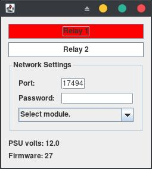

# ETH002 Java example

This is an example Java program that can be used to test the ETH002. It can be used to monitor and control the relay outputs. The project is distributed as a netbeans project, and is built with gradle.

The ETH002 is a Ethernet connected module that provides 2 volt free contact relay outputs. It has a simple TCP/IP control interface, and MQTT support with TLS encryption. More details can be found [on our website.](https://www.robot-electronics.co.uk/eth002b.html)



## Build

Open the project in netbeans and press the build button.

If you do not use netbeans run the following in the root of the project:
```
./gradlew jar
```

The output jar will be in *eth002/build/libs*


